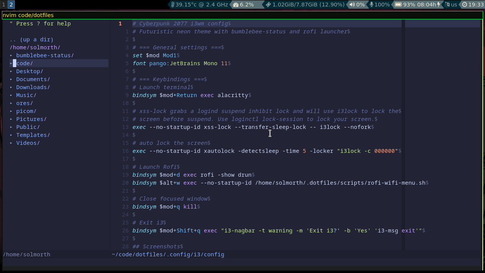
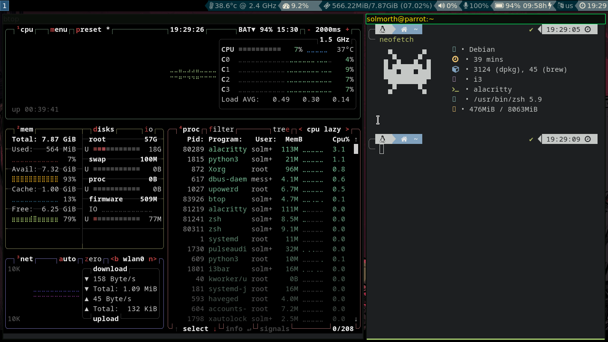
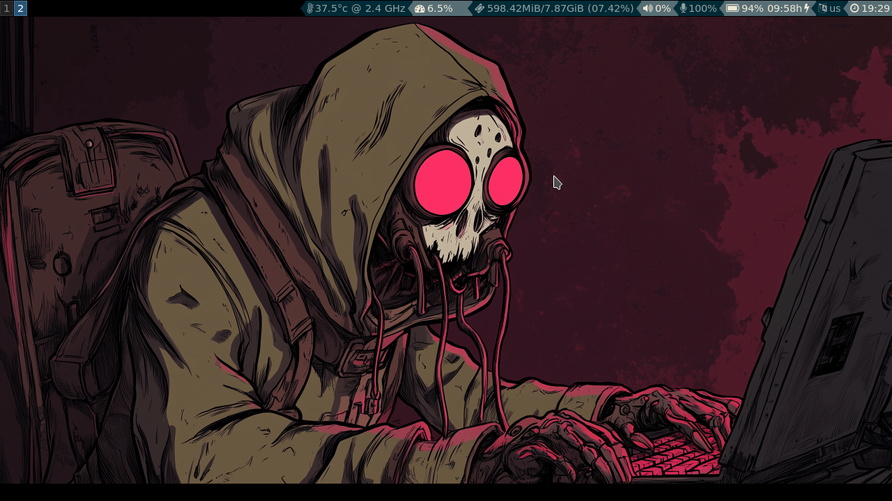

Configuration files for a minimal and efficient tiling window manager environment.

## Overview

This repository contains configuration files for:
- **i3** – lightweight tiling window manager  
- **Rofi** – application launcher and window switcher  
- **Neovim** – modern text editor with plugin and LSP support  
- **Alacritty** – fast, GPU-accelerated terminal emulator  
- **bumblebee-status** – modular and lightweight status bar for i3
- **Zsh** with **Oh My Zsh** – customizable and user-friendly shell environment  
- **bumblebee-status** – modular and lightweight status bar for i3  

The setup is designed for productivity and simplicity, focusing on keyboard-driven workflows and clean aesthetics.

## Features

- Tiling window management and custom workspace setup  
- Keyboard-driven workflow with optimized keybindings  
- Rofi as an application launcher, window switcher, and power menu  
- Alacritty terminal with Nerd Font and theme support  
- Neovim configured with plugins
- Zsh with Oh My Zsh for enhanced shell experience (aliases, completions, themes)  
- bumblebee-status for system metrics and modular status bar  

## Screenshots

